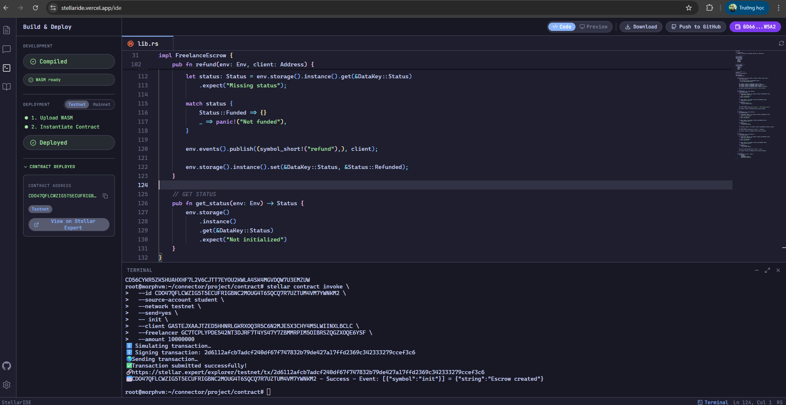

# 🚀 Freelance Escrow dApp (Stellar)

A decentralized escrow payment system for freelancers, built on Stellar using Soroban smart contracts.

## 📌 Overview

Freelance Escrow dApp là một ứng dụng blockchain giúp giải quyết vấn đề thanh toán thiếu tin tưởng giữa freelancer và khách hàng quốc tế.

Thay vì phụ thuộc vào bên trung gian (PayPal, Upwork...), hệ thống sử dụng smart contract để:
- Giữ tiền an toàn (escrow)
- Chỉ giải ngân khi công việc hoàn thành
- Minh bạch và không thể gian lận

## ❗ Problem

Freelancers thường gặp các vấn đề:
- ❌ Bị chậm thanh toán
- ❌ Bị từ chối trả tiền sau khi hoàn thành công việc
- ❌ Phí cao (3–5%) từ các nền tảng trung gian

## 💡 Solution

Ứng dụng sử dụng Soroban Smart Contract trên Stellar để:
- 🔒 Lock tiền trong contract (escrow)
- ✅ Chỉ release khi client xác nhận
- ⚡ Thanh toán gần như tức thì
- 💸 Phí cực thấp (~$0.000003)

## 🧠 Key Features

- 💰 **Escrow Payment (Core)**
- 🔐 Secure fund locking via smart contract
- 🚀 Instant release upon completion
- 🔄 Refund mechanism
- 🌐 Cross-border payments using USDC/XLM

## ⚙️ Tech Stack

| Layer | Technology |
| --- | --- |
| Blockchain | Stellar (Soroban) |
| Smart Contract | Rust + soroban-sdk |
| Frontend (optional) | React / Vite |
| Backend (optional) | Node.js / Firebase |

## 🔄 How It Works

**Flow:**  
`Client` → `Deposit` → `Smart Contract` → `Release` → `Freelancer`

**Steps:**
1. Client creates escrow
2. Client deposits funds
3. Freelancer completes work
4. Client releases payment
5. Smart contract transfers funds

## 🧪 Demo (Testnet)

- **Network:** Stellar Testnet
- **IDE:** [Stellar IDE](https://stellaride.vercel.app/ide)
- **Contract Address (Testnet):** [`CDO47QFLCWZIGST5ECUFRIGBNC2MDUG4T6SQCQ7R7UZTUM4VM7YWNKM2`](https://stellar.expert/explorer/testnet/contract/CDO47QFLCWZIGST5ECUFRIGBNC2MDUG4T6SQCQ7R7UZTUM4VM7YWNKM2)
- **Transaction (init):** [View on Stellar Expert](https://stellar.expert/explorer/testnet/tx/2d6112afcb7adcf240df67f747832b79de427a17ffd2369c342333279ccef3c6)
- **Token:** USDC (or custom token)
- **Actors:** 
  - Client: `GASTEJXAAJTZEDSHHNRLGKRXDQ3R5C6N2MJE5X3CHY4M5LWIIWXLBCLC`
  - Freelancer: `GC7TCPLYPDE542NT3DJRF7T4YS47Y7ZBMMRPIM5OIBRSZQGZXQQEGYSF`

### 🖥️ Deployment Screenshot


*(Lưu ý: Bạn hãy lưu bức ảnh screenshot vào thư mục dự án với tên `demo.png` để hiển thị trên Github)*

## 📦 Smart Contract Functions

| Function | Description |
| --- | --- |
| `init` | Initialize escrow |
| `deposit` | Client deposits funds |
| `release` | Release funds to freelancer |
| `refund` | Refund to client |

## 🛠️ Getting Started

### 1. Clone project
```bash
git clone https://github.com/TheAnh1404/FreelanceEscrowdApp.git
```

### 2. Build contract
```bash
cargo build --target wasm32-unknown-unknown --release
```

### 3. Deploy contract

Sử dụng:
- Stellar CLI
- hoặc Stellar Laboratory

### 4. Test flow
`init` → `deposit` → `release`

## 📊 Why Stellar?

|  | Traditional Finance | Stellar |
| --- | --- | --- |
| **Fees** | 3–5% fees | ~$0.000003 |
| **Speed** | 1–5 days | ~5 seconds |
| **System** | Centralized | Decentralized |

## 🔥 What Makes This Project Stand Out

- Real-world use case (freelance economy)
- Blockchain + smart contract integration
- Financial application (high business value)
- Clean and simple MVP with scalability

## 🚀 Future Improvements

- ⏳ Deadline-based auto refund
- ⚖️ Dispute resolution system (arbiter)
- 📊 Multi-milestone escrow
- 📱 Full frontend dApp UI

## 👨‍💻 Author

- **Name:** Nguyễn Thế Anh
- **Role:** Blockchain Developer
- **Focus:** Smart Contracts, Web3, Distributed Systems